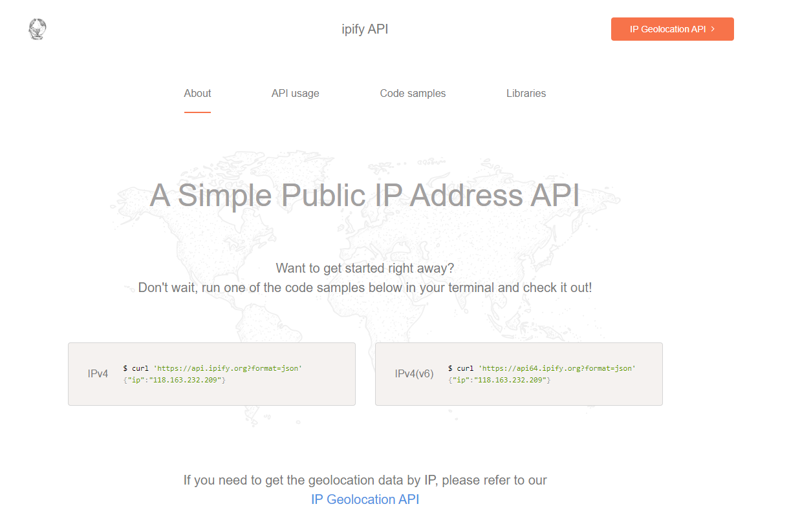

# [Angular]在Angular取得客戶IP


有些情境可能會需要客戶端的IP來做事，例如:log等，一般作法會建議自己撰寫後端程式來解析獲得IP位置，但還有另一方法可以更快取得IP！


<!--more-->

## 1. 第三方服務

這邊我們會使用第三方開源取得IP服務[ipify](https://www.ipify.org/)的API 來快速取得IP。


<br>

照官方的範例，將此段貼至網頁的網址....結束

```bash
https://api.ipify.org?format=json
```


<h2> 看到這邊會發現挖塞也太快了 </h2>

<br>

 接下來讓我們在Angular實作


## 2. 在Angular 實作取得IP服務

### 2.1 建立ip-service.ts服務
使用Fetch 呼叫API (Fetch 預設使用GET呼叫)


```typescript
import { Injectable } from '@angular/core';

@Injectable({
  providedIn: 'root',
})
export class IPService {

  constructor() {}

  async getIPv4(): Promise<string> {
    return new Promise((resolve) => {
      fetch('https://api.ipify.org/?format=json')
        .then((response) => {
          if (response.ok) return response.json();
          throw new Error('Network response was not ok.');
        })
        .then((data) => resolve(data.ip))
        .catch((err) => resolve('not found'));
    });
  }
}
```

### 2.2 實作功能
過來只要在要使用的地方建構注入IPService即可！
```typescript
public ipAddress: string;

constructor(
    private IPService: IPService,   
  ) {}

 async ngOnInit(): Promise<void> {
    // 取得 IP
      this.ipAddress = await this.IPService.getIPv4();
    }
```

---
## 參考
[iptify](https://www.ipify.org/)


