# [DevOps]從Azure DevOps 部署到私有伺服器

用了Azure DevOps 一陣子後會發現如果我機器在地端呢？

好在微軟本身就已考慮這個情況，這篇文章來介紹不管是地端VM或實體Server能透過幾步驟輕鬆完成CD的機器連結設定!

<!--more-->

## 1. 設定步驟

這邊先確認一下要設定的機器環境的OS部分，微軟很棒的針對了**Windows**、**Linux**、**macOS**都有對應的Agent可以設定安裝。

以下針對Widows 和Linux 敘述

### 1.1  [Windows agnet 安裝](https://learn.microsoft.com/en-us/azure/devops/pipelines/agents/windows-agent?view=azure-devops)

#### 1.1.1 首先確認一下需安裝的環境版本，避免無法成功安裝Agent

>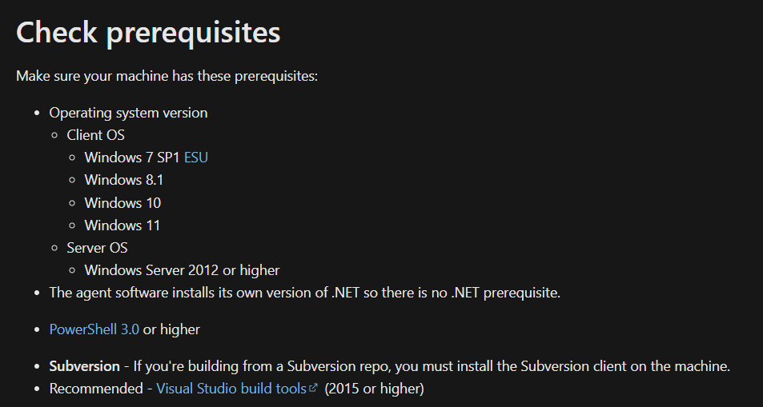

#### 1.1.2 至Azure DevOps右上 "User settings" 選擇 "Personal Access Tokens"

> 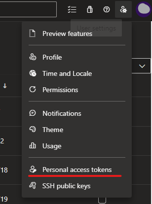

#### 1.1.3 點擊"New Token" --> 填寫 "Token" 名稱並針對Agent Polls 區塊 "Read" 和 "Read & manage" 打勾(若沒看到可以點一下Show all scopes 即可找到) 並建立

- 填寫 和勾選Agent pools區塊
>

- Agent Pools 區塊 
>

- 建立成功(注意這組Token 要存起來後續設定會用到)
>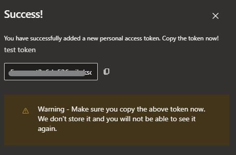

#### 1.1.4 回到Azure DevOps Project 進到 "Deployment groups" 進行相關操作

- 點擊 "New" 並填寫設定名稱
>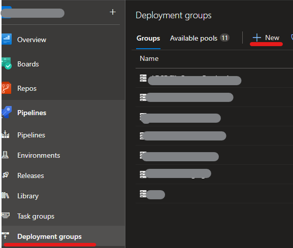

- 複製畫面script 貼至欲安裝agnet環境的PowerShell中執行(administrator)
>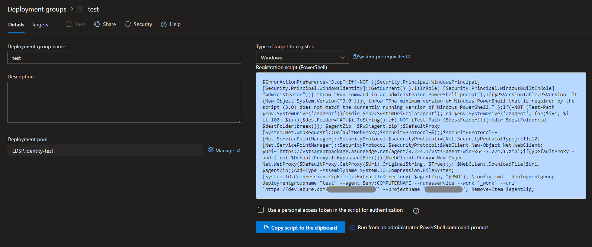

- 輸入1.1.3 拿到的Token 
>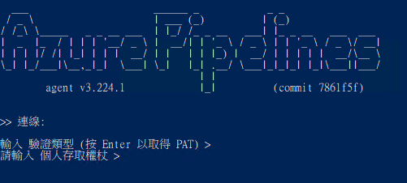

- 輸入群組標籤(依照需求選填)
>

- 啟用背景代理服務(agent 服務自動於windows 背景執行)
>

- 輸入服務的使用者帳戶(預設為NT AUTHORITY\SYSTEM，此帳號權責很大可依照情況自行調整)
>

- 最後會在詢問"是否防止設定完直接啟動"(依照自己需求調整)，都完成後會看到服務成功啟動！
>

- 查看服務狀態(services.msc)
>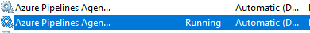

- Azure DevOps Pipelines - Deployment groups 會看到剛設定完的agent 狀態為"Online"
>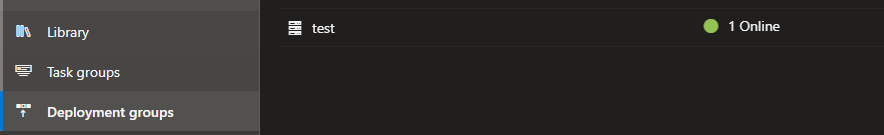

### 1.2  [Linux agnet 安裝](https://learn.microsoft.com/en-us/azure/devops/pipelines/agents/linux-agent?view=azure-devops)

#### 1.2.1 同windows 安裝，確認一下環境

>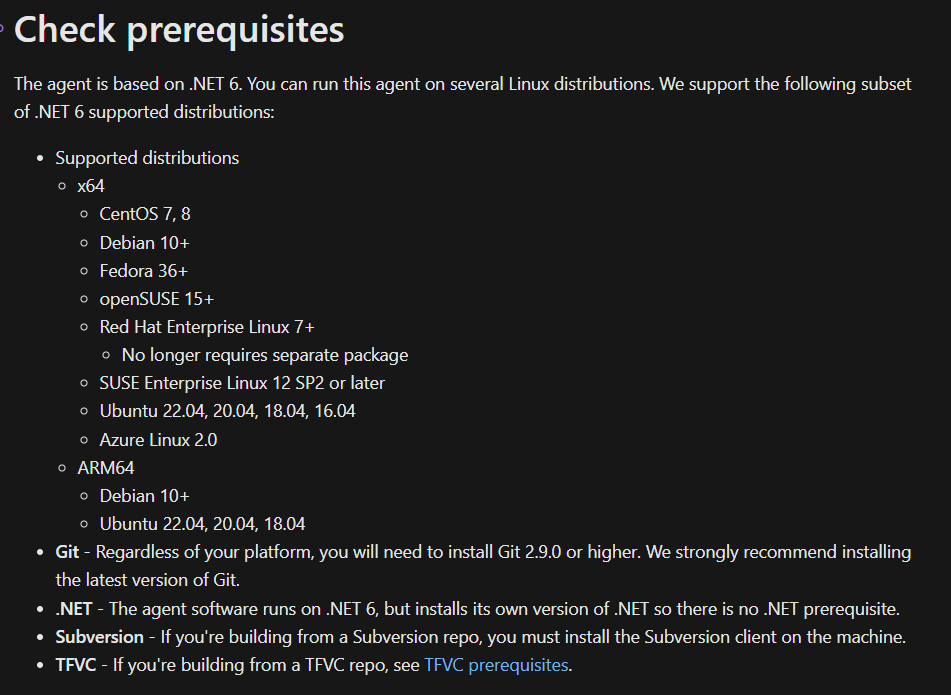

#### 1.2.2 取得Personal Access Token 和進到Deployment groups 設定 (詳細步驟同1.1.2~1.1.4)

- 複製 Linux agent script 貼至欲安裝agnet環境的shell中執行(sudo)
>

- 輸入1.1.3 拿到的Token 
>

- 輸入群組標籤(依照需求選填)

>

- 啟用背景代理服務(agent 服務自動於Linux背景執行)

>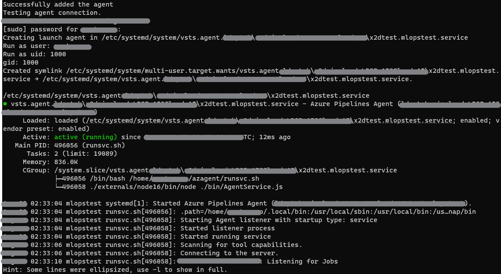

- Azure DevOps Pipelines - Deployment groups 會看到剛設定完的agent 狀態為"Online"
  
>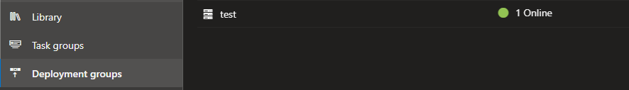

### 2. Azure DevOps Pipelines 部署調整

設定完機器連接後，回到Azure DevOps - Pipelines(Release) CD 的Task Job 相關設定中 可以看到Deployment group 可以選設定完的地端機器了！

>

 

Deployment gruop 也有提供基本的部署狀況資料供人員掌握情況

---
## 參考
[Azure DevOps agent on deployment](https://learn.microsoft.com/en-us/azure/devops/pipelines/release/deployment-groups/?view=azure-devops#set-up-agents-on-deployment-groups)

[Azure DevOps agent on management](https://learn.microsoft.com/en-us/azure/devops/pipelines/agents/linux-agent?view=azure-devops)

