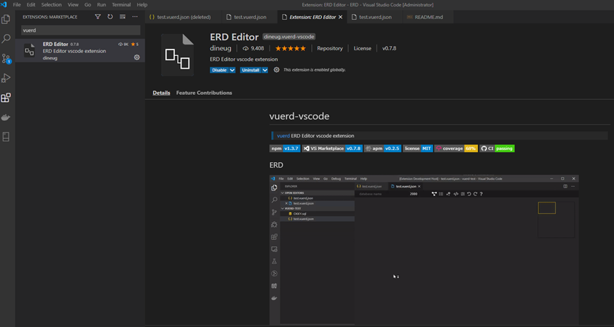
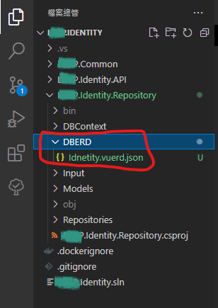
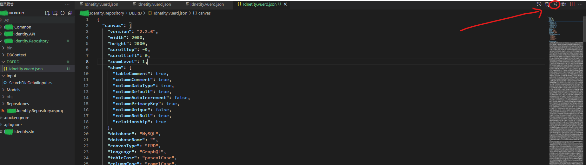
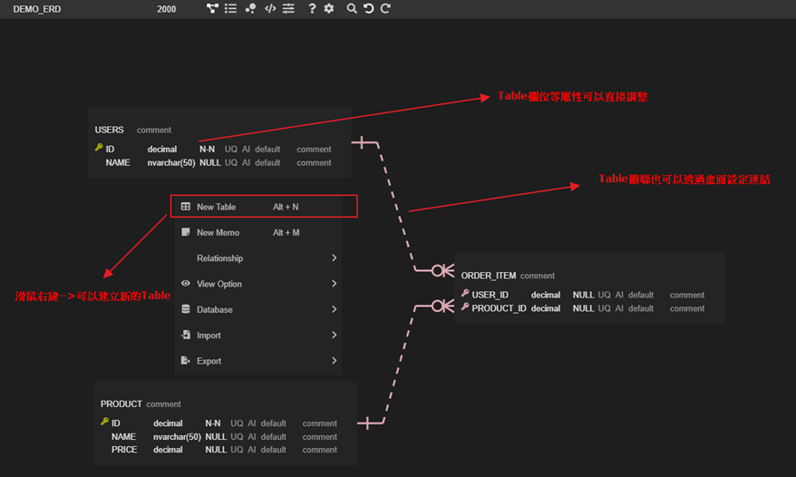
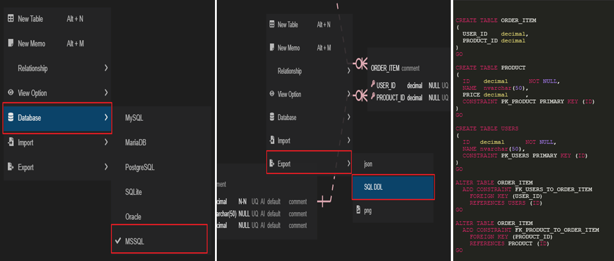
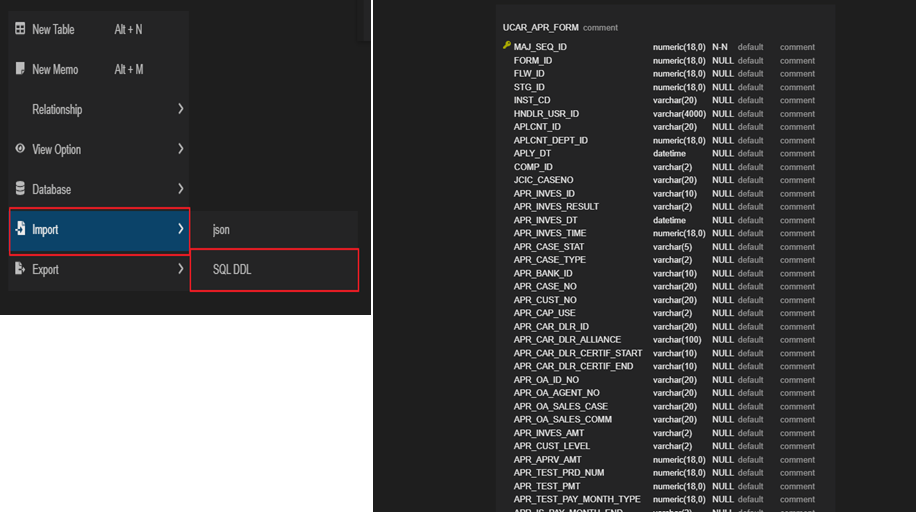

# [Tools]VS Code Plugin - ERD Editor 筆記

相信在許多軟體開發上，前期分析難免會碰到資料庫的設計與規劃，若手頭上剛好有VS Code 這套IDE工具，可以來試試這個很讚的plugin吧！<!--more-->

## 1. 說明
- 需先具備安裝 [VS Code](https://code.visualstudio.com/) (根據自身OS選擇合適的版本)
- 為使ERD設計能有一致性的規劃(不論DB使用哪種版本 Ex: MSSQL、MySQL..等)和Generate DB Script，也能使DB架構規劃能版控

## 2. ERD Editor 使用

- 在VS CODE 左方控制列尋找Extensions或 CTRL + SHIFT+ X ，接著輸入 vuerd 找到該套件並安裝
  >

- **ERD 檔案設定**
   
    若為新專案則在LDSP.XXXX.Respository內找到DBERD的資料夾，並在該資料夾底下修改Template.vuerd.json 的file，右邊視窗看到檔案內容和點擊右上角切換GUI編輯模式。
   >

  >

- **ERD 設計**
   
    擁有GUI 介面，換句話說可以直接在介面上做規劃，協助更快更直覺的操作。
  >

- **Generator SQL DDL**
   
   
  能產出各大主流DB的DDL語法(Export 前需先選擇Database版本，DDL才會產出正確的版本! )。
  >

- **SQL DDL Import** 
   
    將DDL匯入反向產生ERD關聯圖
  >

## 3. 參考
[ERD Editor](https://marketplace.visualstudio.com/items?itemName=dineug.vuerd-vscode)
