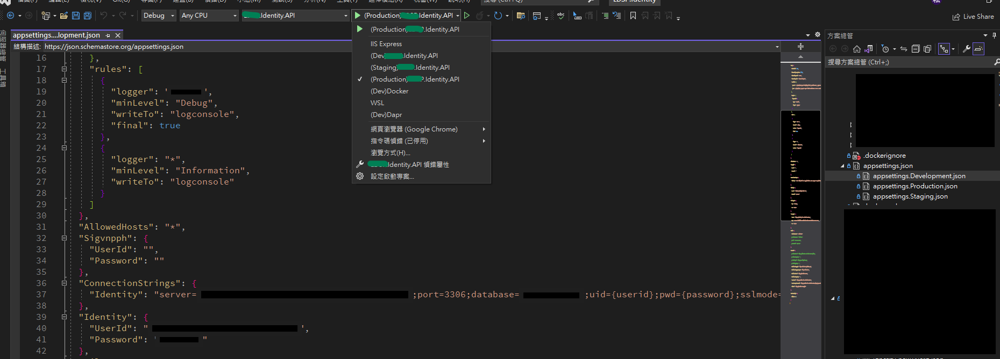

# [Kubernetes]如何讓ASP.NET Core在AKS 和 Azure DevOps CD 中綁訂環境變數

許多玩容器化的人均會面臨到「如何將環境變數設定」映射到應用程式內，因應目的不同多個環境(Dev、UAT、PROD等)該怎配置?，這邊手頭上目前碰到的組合.NET Core 6 + Azure DevOps CD + AKS 來說明
<!--more-->


## 1. Kubernetes(k8s) 變數簡介

k8s要設定環境變數絕對會看過兩個配置：**ConfigMaps**、**Secrets**，這兩項還不是很清楚也可以參考官方對於[configmap](https://kubernetes.io/docs/concepts/configuration/configmap/)和[secrets](https://kubernetes.io/docs/concepts/configuration/secret/)的解說，以下為一張運用場景圖

>


## 2. ASP.NET Core 部分

在開發角度很常如圖這樣設定變數，像是DB Connection也會在`appsettings.XXX.json`其中(擷取其中一段)
>
```json
  "ConnectionStrings": {
    "Identity": "server=xxxxxxxxx;port=3306;database=xxxxxx;uid={userid};pwd={password};sslmode=Preferred"
  },
  "Identity": {
    "UserId": "xxxxxx",
    "Password": "xxxxxxxx"
  },
```

**但如果透過CD又佈署到環境該如何依照所屬環境參考變數?**


## 3. Azure Devops CD(Release)

在CD過程中會將image 透過yaml撰寫佈署描述來執行(Deployments、ReplicaSet等)，而在其中會有定義環境參考的敘述

```YAML 

identity/deployment.yaml
apiVersion: apps/v1
kind: Deployment
metadata:
  name: identity
  labels:
    app: identity
  namespace: auth
spec:
  replicas: 1
  selector:
    matchLabels:
      app: identity
  template:
    metadata:
      labels:
        app: identity
    spec:
      containers:
      - name: identity
        image: xxx/identity:latest       
        ports:
        - containerPort: 80
        env:
          - name: ConnectionStrings__Identity
            valueFrom:
              configMapKeyRef:
                name: xxx-configs
                key: db.connection
          - name: Identity__Password
            valueFrom:
              secretKeyRef:
                name: xxx-secret
                key: db.password
          - name: Identity__UserId
            valueFrom:
              secretKeyRef:
                name: xxx-secret
                key: db.username
  
```

會看到env區塊有與在程式端環境設定檔相似的變數參照，而`configMapKeyRef`和`secretKeyRef`敘述則為k8s環境中變數實際的名稱和對應映射Key，但這邊設定完先確認k8s上是否設定ConfigMap和Secret了沒，不然可能因為k8s上還沒設定ConfigMap和Secret而參照不到失敗!


## 4. Kubernetes上的環境變數設定

首先我們要準備兩份yaml檔，各別為`ConfigMap`和`Secret`，並設定到k8s

### ps. **`建議`** 將機敏資訊存放於Secret中(預設使用Opaque type 且為base64編碼方式)!!

ConfigMap
```YAML
apiVersion: v1
kind: ConfigMap
metadata:
  name: xxx-configs
  namespace: auth
data:
  db.connection: >-
    server=xxxxx;port=3306;database=xxxx;uid={userid};pwd={password};sslmode=Preferred
```
Secret
```YAML
apiVersion: v1
kind: Secret
metadata:
  name: xxx-secret
  namespace: auth
type: Opaque
data:
  db.password: dGVzdA==
  db.username: dGVzdDEyMzQ=
```


---
## 參考

[Kubernetes.io](https://kubernetes.io/zh-cn/docs/concepts/)

---

以上完成就可以享受設定的成果~


