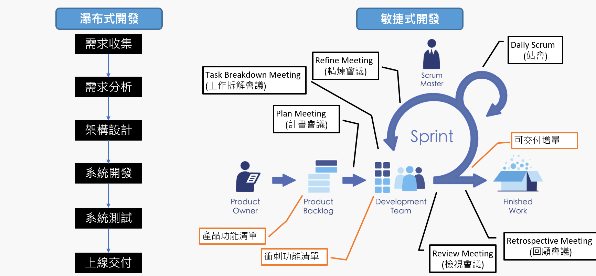

# [專案管理]淺談敏捷專案管理實務Part 1

在許多公司的軟體發展管理上，逐漸盛行敏捷管理(Agile)也很常聽到名詞`敏捷`、`快速`、`Scrum`等，在幾次面試新進員工跟了解其在過去參與的敏捷管理的經驗，發現認知與執行的內容慘不忍睹，喪失了敏捷其核心理念，有鑒於此還是筆記一下敏捷管理方法的實務和常見的瀑布式開發(WaterFall)差異到底在哪呢?
<!--more-->

## 1. 敏捷理念
`敏捷`一詞源自[`敏捷宣言(Agile Manifesto)`](https://code.angularjs.org/1.6.10/docs/guide/migration)，著重於
- **個人與互動** 重於 流程與工具
- **可用的軟體** 重於 詳盡的文件
- **與客戶合作** 重於 合約協商
- **回應變化** 重於 遵循計劃 

裡面也很表明提出的看法優先序左邊項目大於右邊項目，**但但但但**不表示右方不必執行與規劃，其[背後理念(principles)](http://agilemanifesto.org/principles.html)挑出幾個最常被誤會跟沒有落實的觀點

- ***最優先的任務，是透過及早並持續地交付有價值的軟體來滿足客戶需求。***

- ***經常交付可用的軟體，週期可以從幾週到幾個月，以較短時間間隔為佳。***

- ***產品人員與軟體開發者必須在專案全程中天天一起工作。***
  
- ***面對面的溝通是傳遞資訊給開發團隊及團隊成員之間效率最高且效果最佳的方法。***
 
### `綜合以上其實會發現敏捷的快速來自於持續地交付有用的軟體，關鍵也在建構溝通合作的自我管理團隊`

---
## 2. 敏捷VS瀑布

敏捷說穿只是一個思維，常聽到的`Scrum`為其實現這個理念的其中一個流派，讓我們先來試問團隊是否需要敏捷?

 >### **產品市場和需求是否明確?**

舉個例子

就如耳熟能詳的產品ERP、電商系統等，這類軟體產品通常在市場均有成熟的解決方案，若是想要參考模仿開發出相似軟體產品均可借鏡，也就對於`需求和市場有一定的認知和範圍`，那此時是否反而用常見的瀑布式開發來完整規劃參與的人、事、物、時間、成本等，也能較掌握風險的控管。

## `以上點出敏捷並不適用於任何情境`

## `而是針對目標選用合適的管理方法為最佳方式`

### 讓我們來看看敏捷流程跟瀑布的流程差異

>

本質差異除了`做事思維的不同外`，相對於敏捷，瀑布式在個階段均須有對應文件與規劃(如SRS、SDS、WBS等)缺一均會影響專案執行和品質。

敏捷注重團隊溝通和做團隊認為最優先的事情以利最短時間內完成`最小可行性產品(MVP)`並持續驗證產品可行性，快速即時修正調整產品方向，依此來降低執行專案風險

下一篇來介紹Scrum 執行實務內容和最小可行性產品(MVP)

