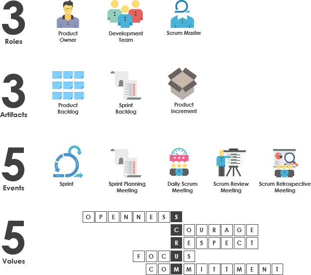
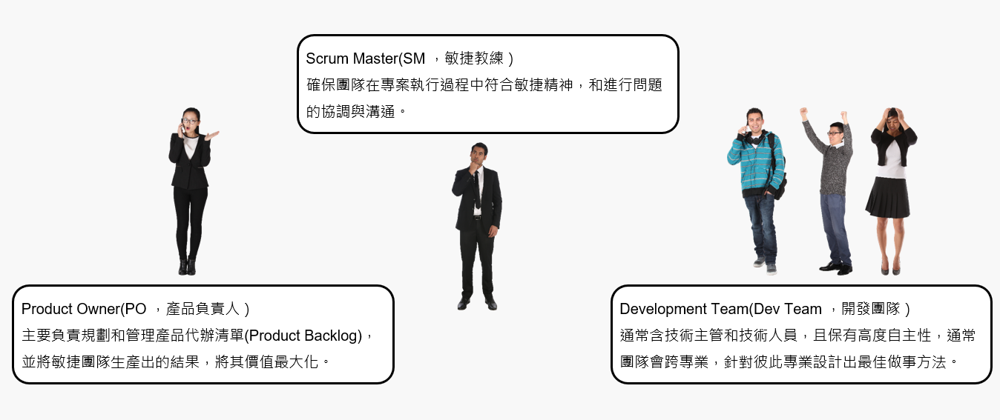
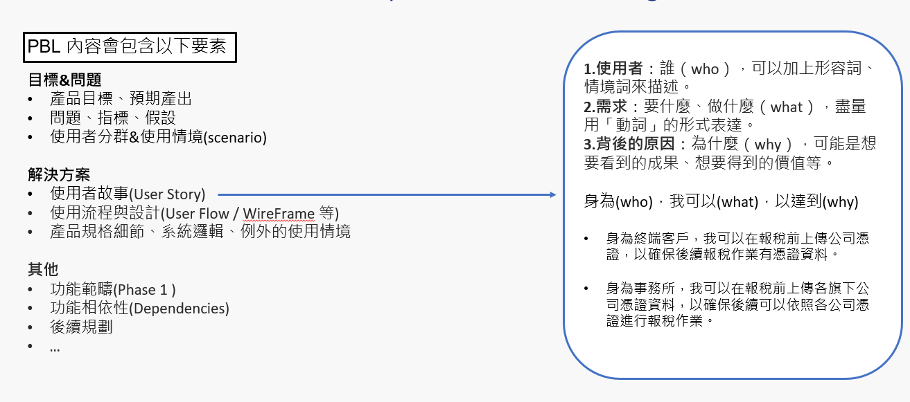
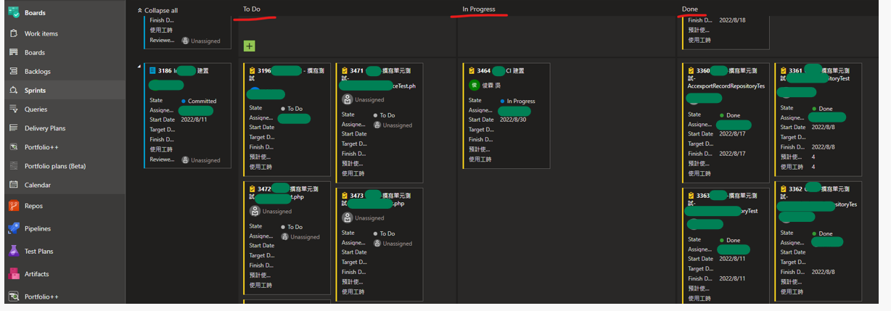
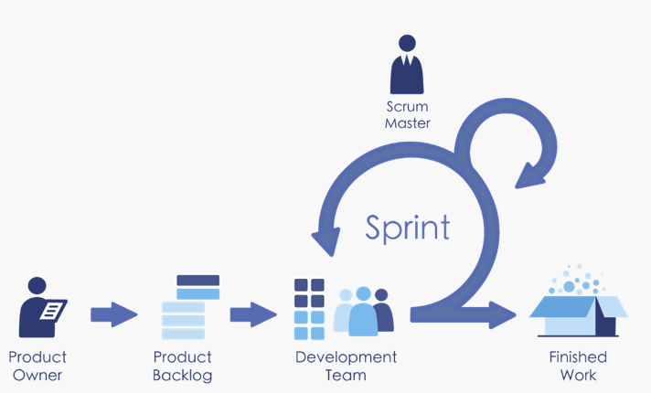

# [專案管理]淺談敏捷專案管理實務Part 2

延續上次[敏捷管理實務Part1](/projectmanagent1) 內容，本篇針對Scrum流派的實務內容和甚麼是所謂的最小可行性產品介紹~
<!--more-->

## 1. Scrum框架下的"3355"

Scrum下3355為其實務執行的核心，指的是
 
- #### 3個角色(scrum roles)
- #### 3個工單(scrum artifacts)
- #### 5個事件(scrum events)
- #### 5個價值(scrum values)

- 
##### [參考](https://www.visual-paradigm.com/tw/scrum/what-is-3355-in-scrum-framework/)

 

### **接下來逐步講解這些概念**
 

### 3個角色(scrum roles)

從以上可以發現三個角色為Scrum執行團隊的主軸，`SM負責保持專案執行Scrum的各項精神和協調`，`PO則為產品需求的規劃和來源`，`Dev Team則為產品技術端設計和實作`，也為Scrum起頭實作最為重的關鍵

### 3個工單(scrum artifacts)

1. **Product Backlog(PBL)**：將目標轉化成能夠實作的細節的工具為產品需求規格文件(PRD)或稱軟體需求規格書(SRS)，在瀑布式專案管理下，此份文件為最重要且也為`「產品經理與開發團隊溝通」`的第一步；而在敏捷式管理提到`「可用的軟體重於詳盡的文件」`，不必於最初將各種文件詳細產出，但還是要依照節奏依序將需求完善(PBL)，要素參考下圖
   
 - 

2. **Sprint Backlog**：有了前面的PBL後，開始依照優先序放到Sprint中，團隊針對每個
Sprint 關注這次需要完成和增量的PBL項目和其展開的工作內容，下圖為Azure DevOps實作Scrum例子

 - 

3. **Product Increment**：又稱`產品增量`，每個Sprint 完成PBL後`「滿足驗收條件」`並為`「已完成」`的增量或內容，通常為可`產生產品價值`部分，如功能或產品等

### 5個事件(scrum events)

1. **Sprint(衝刺)** ：指的是每個連續開發週期，也含各個會議的流程，這邊的週期單位則以Iteration(迭代)來表示，通常會設定在1-4周之間，並在每個Sprint 執行相同的Iteration 時間循環(節奏)。

 - 

2. **Sprint Plan Meeting** ：為Sprint中，不可缺少的會議之一，內容參考下方表格說明

>>|ITEM|詳細說明|
>>|--|--|
>>|WHY|為即將要開展的Sprint指定計劃|
>>|WHO|Scrum Team|
>>|WHEN|Sprint第一天|
>>|WHAT|本sprint要交付的內容如何完成，由PO講述Product Backlog  與Acceptance >Criteria，並由開發團隊評估Product Backlog 大小，以提供開發團隊後續進行task拆分>與認領|
>>|INPUT|產品列表 最新增量 團隊容量 歷史資料|
>>|OUTPUT|本次sprint的backlog|

3. **Sprint Daily Scrum Meeting** ：又稱`站會`，也是敏捷管理中讓大家最有印象的會議

>>|ITEM|詳細說明|
>>|--|--|
>>|WHY|指定24小時的計劃|
>>|WHO|Scrum Team|
>>|WHEN|每天 固定時間 規定地點|
>>|WHAT|3個問題 我昨天作了什麼/我今天要做什麼/我有什麼問題|
>>|HOW LONG|10分鐘之內|
>>|INPUT|Sprint待辦列表|
>>|OUTPUT|Sprint待辦列表|

4. **Sprint Review Meeting**：審視會議，又俗稱`Demo`會議，會議主要展示&評核該次Sprint的增量成果

>>|ITEM|詳細說明|
>>|--|--|
>>|WHY|檢視增量並調整|
>>|WHO|Scrum Team + Stake Holder|
>>|WHEN|Sprint結束時|
>>|WHAT|1.done和undong的check 2.問題 3.成果演示|
>>|INPUT|增量 / Product Backlog / Issue List|
>>|OUTPUT|修訂版Product Backlog/下一個Sprint的Sprint Backlog/獲取反饋促進合作|

6. **Sprint Retrospective Meeting**：回顧會議，用來檢視回顧該次Sprint的執行狀況，秉持`捨去不好的留下好的`，並在之後Sprint持續精進

>>|ITEM|詳細說明|
>>|--|--|
>>|WHY|回顧此次Sprint|
>>|WHO|Scrum Team + Stake Holder|
>>|WHEN|Sprint結束時|
>>|WHAT|1.專案回顧 2.收集資訊 3.收集回饋 4.持續追蹤|
>>|INPUT|Sprint資訊|
>>|OUTPUT|Action 清單|

### 5個價值(scrum values)
#### Scrum團隊緊密合作，是團隊該每個人具備的內容，也是Scrum中心思維
- Courage(勇氣)
- Focus(專注)
- Commitment(承諾)
- Repect(尊重)
- Openness(開放)

---
## 2. 甚麼是MVP最小可行性產品(Minimum Viable Product)

當判斷目標且發現適合使用敏捷式管理時，往往對於未來充滿不確定性，但如何最低成本、速度、反映到市場上並測試可行就是一大關鍵

敏捷專案把一個想解決的事情給`切分成一塊一塊`慢慢去執行和驗證，但要怎麼切的思考方向也要圍繞在每次切成塊的東西是否符合`可行性`且`可以持續堆疊`。

自己在跟人解釋MVP時 很愛用這張圖來譬喻

目標為解決`人類移動上的問題`，假設每個階段都為每個Sprint的增量，上方可以看到第一次增量僅有一顆輪子並無法拿來做為解決人類移動的`可行性`，而同階段下方可以看到為一個滑板，但其符合`最小`且`可行性`。

***總結當我們在規劃每次Sprint時，盡量以達成MVP為目標來規劃***

---
## 參考
[visual-paradigm](https://www.visual-paradigm.com/tw/scrum/)

[agilemanifesto org](http://agilemanifesto.org/)

[codobux](codobux.medium.com)

---
呼~ 篇長有點多，但卻是敏捷管理法不可忽略的知識還有實作上常常被人遺忘的核心理念，下一篇來撰寫一下運用`Azure DevOps` 來實作敏捷專案管理吧~
