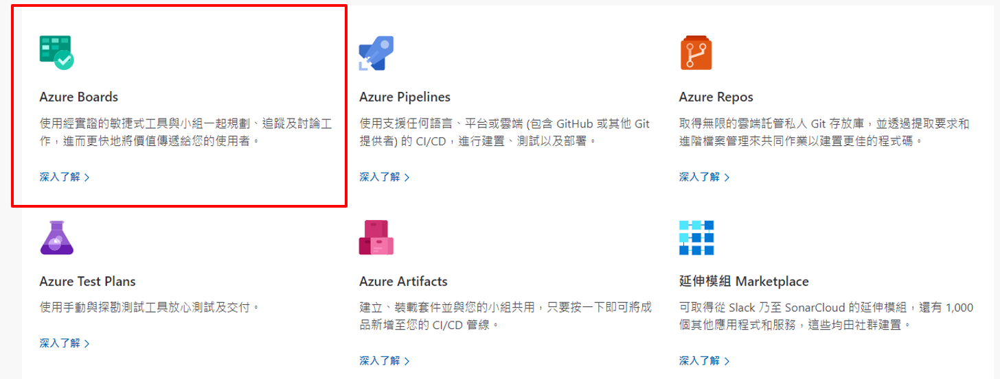

# [專案管理]淺談敏捷專案管理實務Part 3 (with Azure DevOps)

這次會運用**Azure DevOps**來實作敏捷管理，想了解敏捷相關知識可以參考[敏捷管理實務Part2](/projectmanagent2)

<!--more-->

## 1. Azure DevOps 是啥?

先來闡述DevOps，指的是 **「Development」** + **「Operations」** ，精神在於將資訊透明並整合在一起，縮短產品產出時間並達到品質；而 **Azure DevOps** 除了上述也另外整合了需求面，可讓團隊規劃工作。 **Azure DevOps** 支援共同作業文化，可將開發人員、產品和利害關係人整合在一起來開發軟體。

#### ps. Azure DevOps Services為一套SaaS 大部分功能免費流程管理工具，詳細可以參考 [Azure DevOps](https://azure.microsoft.com/en-us/products/devops)

### 而我們今天主要來講 **Azure Boards**
>

## 2. 產品功能清單(PBL) on Azure DevOps Board

### 在Azure DevOps Board  產品清單層級分為四層

##### ps. 需先確認Organization Settings --> Board --> Process ，目前專案是否採用Scrum流程

 

>

 
 

### 2.1 產品清單定義

需求由模糊到清晰：**Epic --> Future --> Product Backlog --> Task**

 

> **這邊可以發現Epic、Future、Product Backlog 是由PO 描述和定義，僅有Task是由開發團隊基於Product Backlog來展開工作清單**

 
 

### 2.2 如何撰寫Product Backlog(PBL)?

將目標轉化成能夠實作的細節的工具為產品需求規格文件(PRD)或稱軟體需求規格書(SRS)在瀑布式專案管理下，此份文件為最重要且也為「產品經理與開發團隊溝通」的第一步

而在敏捷式管理提到 **「可用的軟體重於詳盡的文件」**，不必於最初將各種文件詳細產出，但還是要依照Sprint節奏依序將需求完善(PBL)。

 

 
 

### 2.3 敏捷和產品清單工作流程

以Sprint 執行的基準來看Product Backlog 和Task 間的狀態關係如何變化 !

## 結論

淺談敏捷管理系列雖然不及實務完全操作手法，但可以提供幾項思維和參考給目前正在參與敏捷管理或者正在評估敏捷的各位朋友，也希望能幫助到大家，如有內容認知錯誤等也請不吝指教和見諒~~

---
## 參考
[Azure-DevOps](https://azure.microsoft.com/en-us/products/devops)

[agilemanifesto org](http://agilemanifesto.org/)

[codobux](codobux.medium.com)

